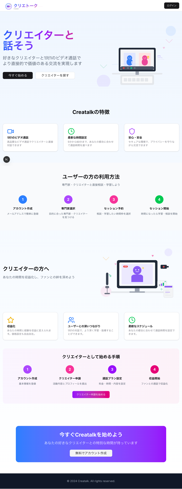
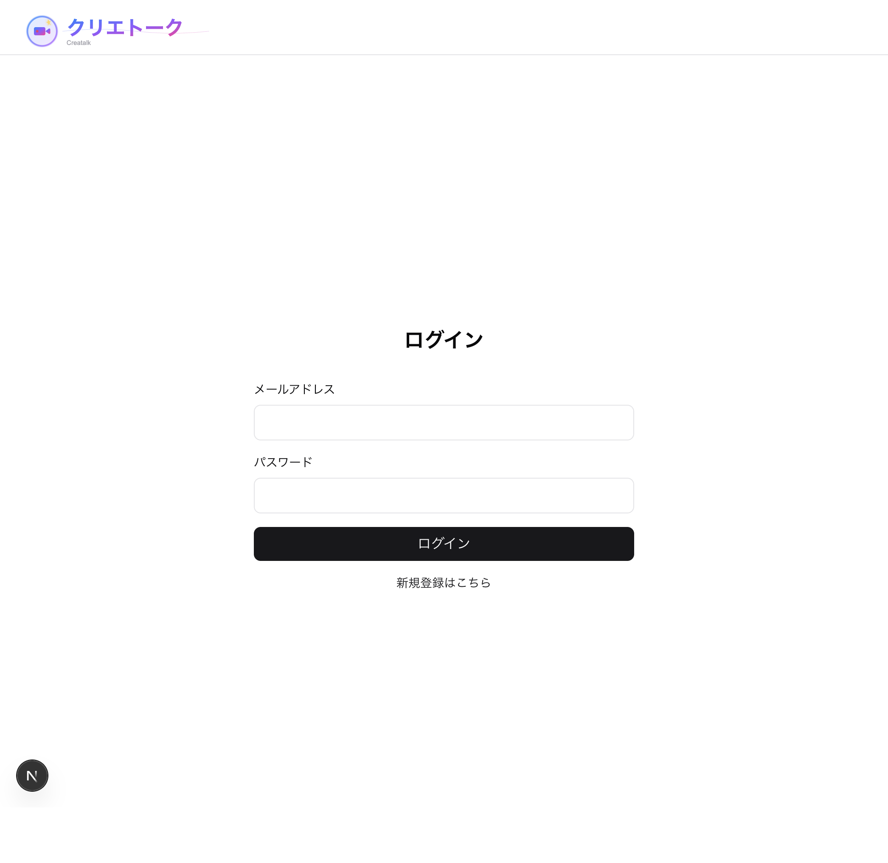
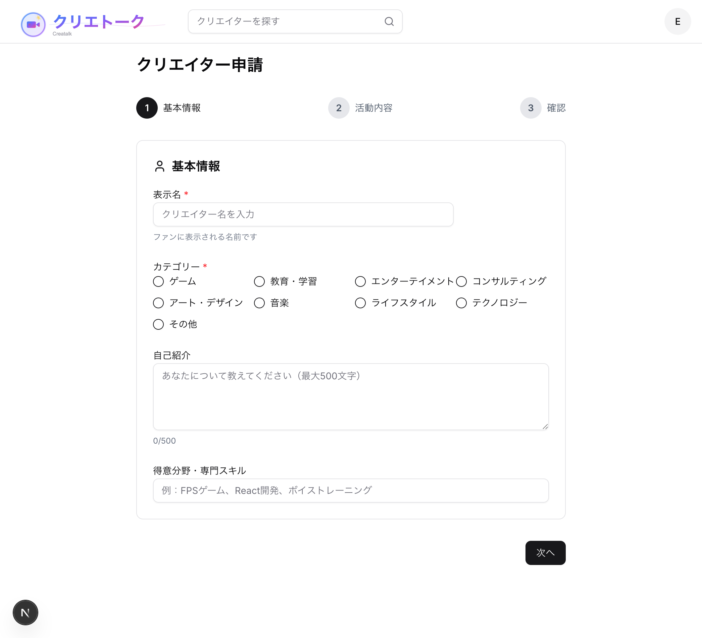
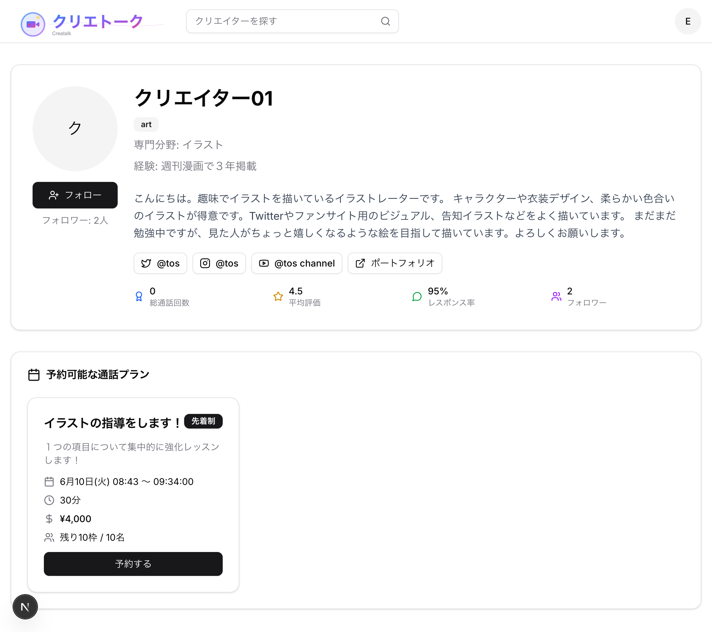
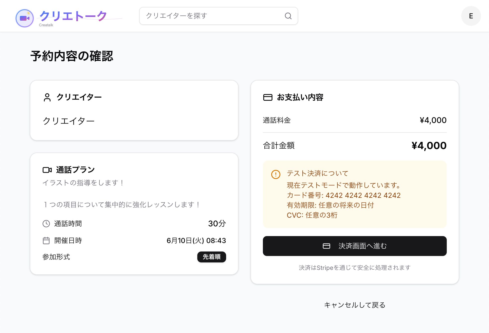
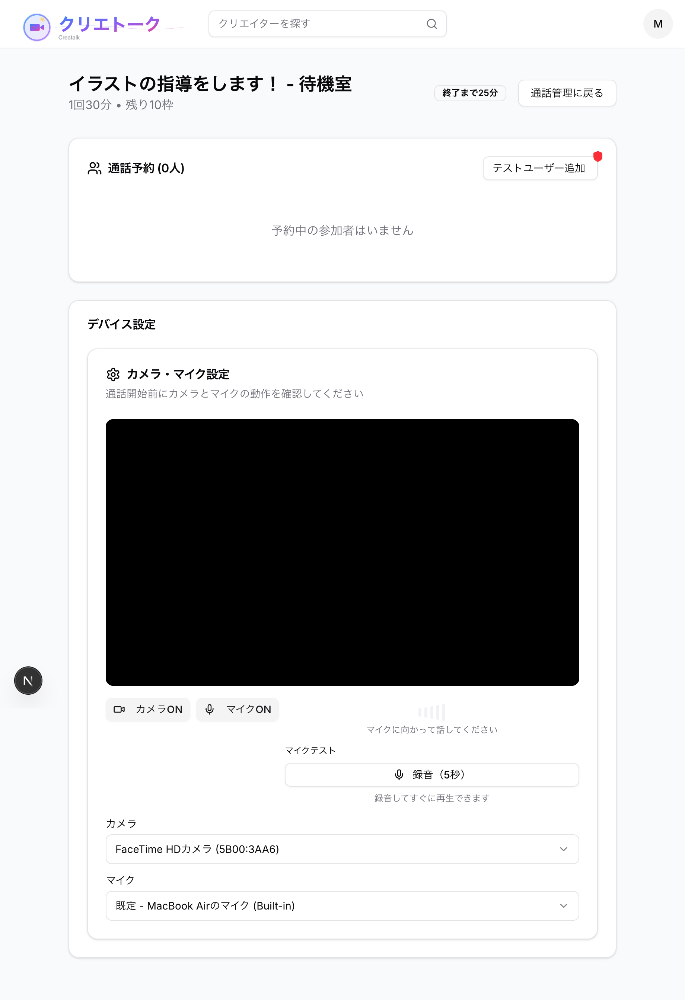
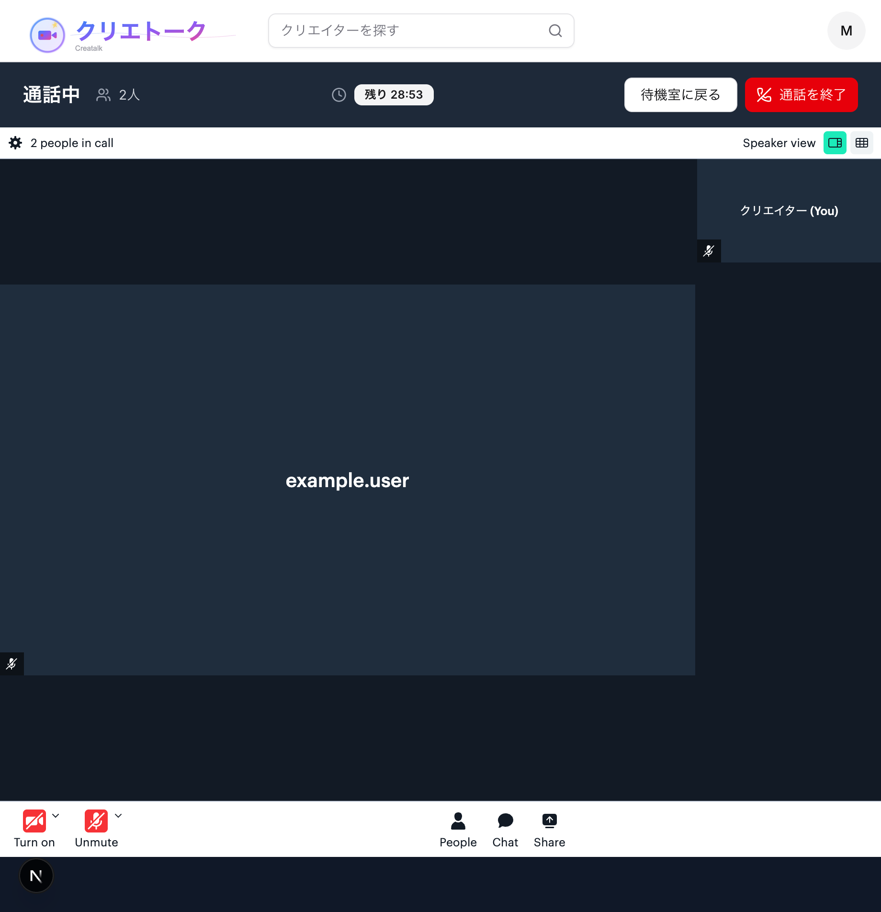
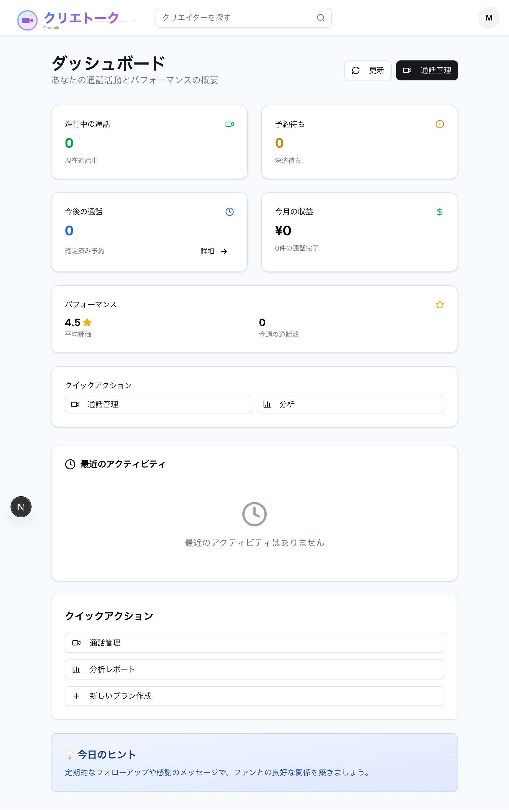
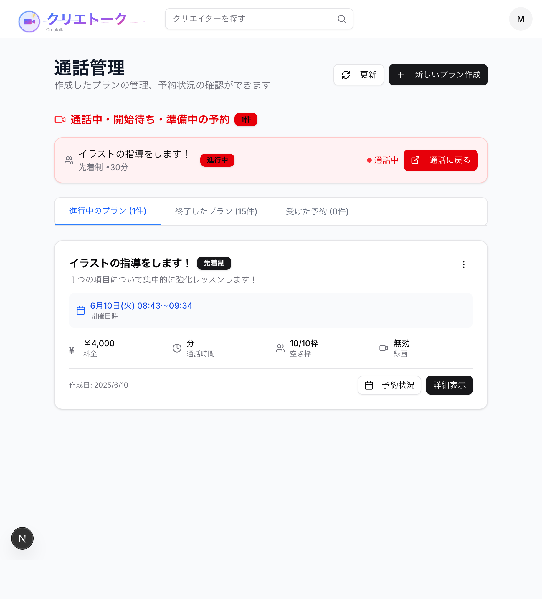

# Creatalk

## 🎯 プロジェクト概要

このプロジェクトは、生成AIを活用してWebアプリケーション開発を学習する目的で作成されています。以前、構想していたクリエイターとファンをつなぐビデオ通話プラットフォームを題材に、最新の技術スタックと開発手法を実践的に学んでいます。

### 開発環境の変遷
- **前半**: Cursor AIを使用した開発
- **現在**: Claude Codeを使用した開発と実験



## 🛠 技術スタック

### フロントエンド
- **Framework**: Next.js 15 (App Router) with Turbopack
- **Language**: TypeScript (Strict Mode)
- **Styling**: Tailwind CSS v4 + shadcn/ui
- **Testing**: Vitest + React Testing Library

### バックエンド
- **Database**: Supabase (PostgreSQL)
- **Authentication**: Supabase Auth
- **Real-time**: Supabase Realtime
- **Storage**: Supabase Storage

### 外部サービス
- **Video Calls**: Daily.co API
- **Payments**: Stripe (Test Mode)
- **Deployment**: Vercel

### 開発ツール
- **AI Assistant**: Claude Code / Cursor
- **Linting**: ESLint + Prettier
- **Type Checking**: TypeScript
- **Version Control**: Git

## ✨ 主な機能

### 1. 認証システム
- メールアドレスによるユーザー登録・ログイン
- 役割ベースのアクセス制御（一般ユーザー、クリエイター、管理者）



### 2. クリエイター申請・承認システム
- クリエイターとしての活動申請フォーム
- 管理者による申請内容の審査
- 承認後の自動役割付与



### 3. 通話予約システム（キュー方式）
- クリエイターが時間枠を設定して待機
- ファンが順番待ちで通話を予約
- リアルタイムでの順番表示



### 4. 予約確認・管理
- 予約内容の詳細確認



### 5. 待機室機能
- 通話開始前の待機室
- デバイス設定（カメラ・マイク）
- 順番待ち状況の確認



### 6. ビデオ通話機能
- Daily.co APIを使用した高品質ビデオ通話
- 音声・映像の切り替え機能
- 通話時間の管理



### 7. 決済システム
- Stripe統合による決済処理

### 8. 管理者ダッシュボード
- クリエイター申請の管理


### 9. クリエイターダッシュボード（レイアウトのみ）
- 基本的なレイアウト構成
- 今後実装予定の機能プレースホルダー
- ナビゲーション構造



### 10. 通話管理機能
- クリエイター用の通話プラン作成・管理画面
- 予約状況のリアルタイム確認



## 🚧 開発状況

### 実装済み機能
- ✅ 認証システム（メール認証）
- ✅ クリエイター申請・承認フロー
- ✅ 通話予約システム（キュー方式）
- ✅ リアルタイムビデオ通話
- ✅ Stripe決済統合
- ✅ 管理者ダッシュボード
- ✅ フォロー機能
- ✅ クリエイター検索機能

### 開発予定機能
- 🔄 OAuth認証（Google、Twitter等）
- 🔄 固定スロット予約システム
- 🔄 クリエイターダッシュボード機能（収益確認、詳細統計等）
- 🔄 通話録画機能
- 🔄 チャット機能（通話中）
- 🔄 レビュー・評価システム

### AI活用のポイント
1. **コード生成**: 基本的な実装の高速化
2. **リファクタリング**: 大規模ファイルの分割・整理
3. **バグ修正**: エラーログからの原因特定と修正
4. **テスト作成**: テストケースの網羅的な生成
5. **ドキュメント**: READMEやコメントの充実

## 🏃‍♂️ Getting Started

### 前提条件
- Node.js 18.0.0以上
- npm
- Supabase アカウント
- Stripe アカウント（テストモード）
- Daily.co アカウント

### セットアップ

1. **リポジトリのクローン**
```bash
git clone [repository-url]
cd creatalk
```

2. **依存関係のインストール**
```bash
npm install
```

3. **環境変数の設定**
```bash
cp .env.example .env.local
```

必要な環境変数:
```env
# Supabase
NEXT_PUBLIC_SUPABASE_URL=your_supabase_url
NEXT_PUBLIC_SUPABASE_ANON_KEY=your_supabase_anon_key

# Stripe
NEXT_PUBLIC_STRIPE_PUBLISHABLE_KEY=your_stripe_publishable_key
STRIPE_SECRET_KEY=your_stripe_secret_key
STRIPE_WEBHOOK_SECRET=your_stripe_webhook_secret

# Daily.co
DAILY_API_KEY=your_daily_api_key
NEXT_PUBLIC_DAILY_DOMAIN=your_daily_domain
```

4. **Stripe設定**
```bash
# Stripe CLIのインストール（Webhookテスト用）
# macOS
brew install stripe/stripe-cli/stripe

# ログイン
stripe login

# Webhookをローカルで転送（開発時）
stripe listen --forward-to localhost:3000/api/webhooks/stripe
```

5. **データベースマイグレーション**
```bash
supabase login
supabase link --project-ref your-project-ref
supabase db push
```

6. **開発サーバーの起動**
```bash
npm run dev
```

## 🧪 テスト

```bash
# テスト実行
npm run test

# カバレッジレポート
npm run test:coverage

# UIでテスト結果確認
npm run test:ui
```

## 📁 プロジェクト構造

```
src/
├── app/                # Next.js App Router
├── components/         # 再利用可能なコンポーネント
├── features/          # 機能別モジュール
├── actions/           # Server Actions
├── hooks/             # カスタムフック
├── lib/               # ユーティリティ関数
├── test/              # テスト関連
└── types/             # TypeScript型定義
```

---

**Note**: このプロジェクトは学習目的で開発されています。